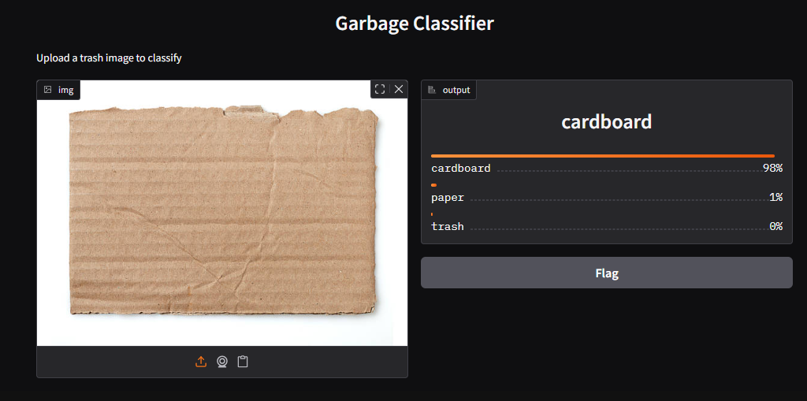

# Garbage Classification - Week 2
This project is part of the AICTE Internship for building a smart garbage classifier using Transfer Learning.

# Week 2 Progress
- Used ImageDataGenerator for data augmentation
- Built improved MobileNetV2-based model with dropout regularization
- Trained model and visualized accuracy/loss graphs
- Integrated Gradio UI to test image predictions live

# Gradio Demo Screenshot
This UI allows users to upload trash images and classify them in real-time:

